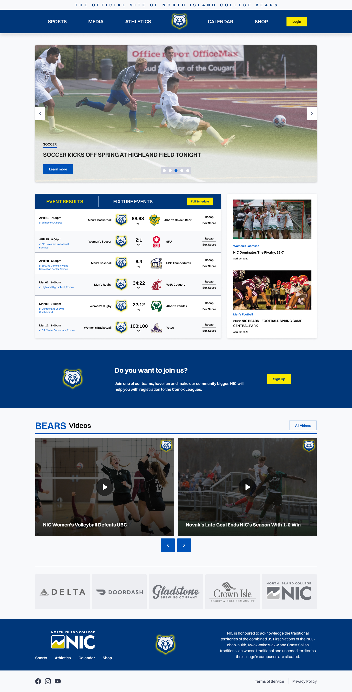

# App Review - NIC Athletics

## Motivation

After the winter semester of 2022 ended, I wanted to do a quick project where I would test the knowledge of Figma I gained in that semester. I wanted to practice making design systems on the biggest scale I could do for a small project and apply the best practicing in UI I've learned so far. 

I like doing real-life projects. So it took me a while to figure out what project I would do. Since I love sports, particularly soccer, I signed up for soccer at Comox Valley Social Club, and when I saw who was our first team to play against, it hit me. We played against the North Island College team. I wondered why NIC doesn’t have its own teams. I knew many players that play on different teams. So, the idea started to make a single-page mockup for a fictional NIC Athletic team website.

## Discover

Before I even started doing any research, I asked myself, “why would NIC need such a website or team.” If I ignore all the administrative and logistic obstacles, I can see a big opportunity for NIC to expand and stand out from all Vancouver Island Colleges/Universities. Potentially, it can attract many new students that love sports. It can make a sports community around sport. It can connect newcomers, new students and other people, especially during the post-COVID time. It will make more straightforward access to sports for people that the NIC brought here. 

Great, the biggest question is answered!

I knew it wasn’t a revolutionary idea to make a college athletic team. There are plenty of colleges that have a long tradition of their sports teams. Nevertheless, it wasn’t a disadvantage. So I started digging into schools' athletic teams and saw how huge those communities are! These websites contain scoreboards, reports, posts, videos, merchandise, fan zones, interviews, etc.

## Develop

I want to practice my HTML/CSS skills. After a quick research, I made a few low-fidelity wireframes and started making my mockup with particular components. I included a header, footer, video carousel, post carousel, CTA where students could sign up to a team (I know this is not how college athletic teams work), post list, trusted companies, scoreboard calendar of events, sign up form and more.

<i>NIC Athletics Mockup</i>

